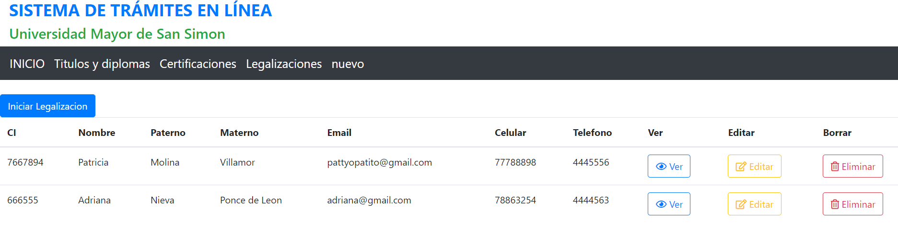

# Legalizations online

This UI belongs to legalization, paperwork and archive department of Universidad Mayor de San Simon

## Development
- Back-end is located in [tramites-online-back](https://github.com/pattyt0/tramites-online-back)

### Run
Run `ng serve` for a dev server. Navigate to `http://localhost:4200/`. The app will automatically reload if you change any of the source files.

### Demo
[tramites-online demo](https://www.youtube.com/watch?v=pfymPIjGo4E)

### Collaborators
- Almanza Perez Ronald
- Alvarez Ramos Luis Henrry
- Molina Villamor Patricia  
- Nieva Ponce de Leon Adriana Lucero
